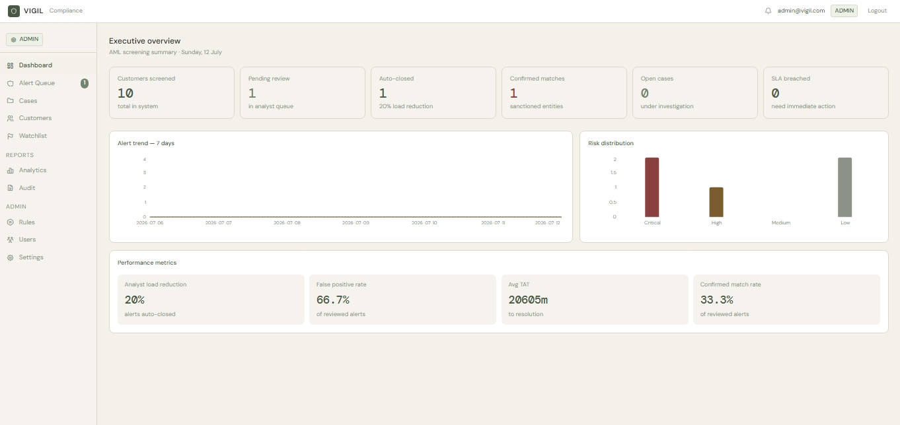

# VIGIL — AML Compliance Screening Platform


> Enterprise-grade Anti-Money Laundering (AML) compliance platform for NBFCs, Banks, and BFSI organizations.



---

# Overview

VIGIL is a full-stack Anti-Money Laundering (AML) compliance platform that automates customer screening, risk assessment, investigation workflows, and compliance decision management.

The platform reduces manual investigation effort by automatically closing low-risk matches while prioritizing higher-risk alerts for analyst review through configurable screening rules.

### Target Environment

Designed for compliance teams processing:

- 700+ AML alerts per day
- Small investigation teams
- 24–48 hour SLA requirements

### Key Benefits

- Automated AML customer screening
- Explainable risk scoring
- Rule-driven compliance decisions
- Complete audit trail
- Four-eyes approval workflow
- Case management with evidence tracking

**Philosophy**

> FAST. EFFICIENT. EFFECTIVE.

---

# Project Metrics

- **8** AML Screening Parameters
- **4** Risk Categories
- **13** PostgreSQL Tables
- **4** Role-Based Access Levels
- **5-Stage** Investigation Workflow
- **JWT** Authentication & RBAC
- **Celery + Redis** Background Processing
- **RapidFuzz** Intelligent Name Matching
- **Immutable** Audit Trail
- **Docker** Containerized Deployment
- **PDF & CSV** Compliance Reports

---

# Features

## AML Screening Engine

- 8-parameter customer screening
- Risk scoring (0–100)
- Four risk classifications
- RapidFuzz fuzzy name matching
- Explainable scoring engine
- Rule version binding
- Immutable screening snapshots

### Screening Parameters

- Name
- Date of Birth
- Government ID
- Nationality
- Occupation
- Adverse Media
- Politically Exposed Person (PEP)
- Sanctions / Watchlists

---

## Risk Classification

| Risk | Score |
|------|------:|
| LOW | 0–29 |
| MEDIUM | 30–49 |
| HIGH | 50–74 |
| CRITICAL | 75–100 |

---

## Compliance Workflow

```
Alert
   ↓
Investigation
   ↓
Analyst Recommendation
   ↓
Compliance Officer Decision
   ↓
Case Closure
```

### Workflow Features

- Four-eyes approval
- Decision locking
- SAR flagging
- SLA monitoring
- Immutable audit logging

---

## Internal Watchlist

Historical customer intelligence overrides risk scores.

| State | Action |
|--------|---------|
| FRAUD_CONFIRMED | Score ≥ 90 |
| SAR_FILED | Score ≥ 75 |
| UNDER_INVESTIGATION | Score ≥ 60 |
| PREVIOUS_ESCALATION | +10 Points |
| FALSE_POSITIVE | No Impact |

---

## Rule Engine

- Database-driven rules
- Runtime rule updates
- Maker-checker approval workflow
- Rule versioning
- Immutable rule snapshots
- Historical feature weight tracking

---

## Case Management

- Investigation cases
- Analyst notes
- Evidence uploads
- Decision history
- Case lifecycle management

### Case Status

- OPEN
- INVESTIGATING
- PENDING_CO
- CLOSED

---

## Reporting

- Audit Reports (PDF)
- SAR Draft Reports
- Case Closure Reports
- Alert Export (CSV)

---

## Role-Based Access Control

| Role | Permissions |
|------|-------------|
| Admin | Full system administration |
| Analyst | Alert review and investigations |
| Compliance Officer | Final approval and SAR filing |
| Checker | Secondary review |

---

# System Architecture

```
                 +----------------------+
                 |     React Frontend   |
                 |  React + TypeScript  |
                 +----------+-----------+
                            |
                         REST API
                            |
                 +----------v-----------+
                 |    FastAPI Backend   |
                 | Authentication       |
                 | Screening Engine     |
                 | Rule Engine          |
                 | Case Management      |
                 +----------+-----------+
                            |
          +-----------------+-----------------+
          |                                   |
   PostgreSQL 17                    Redis + Celery
 Application Database            Background Workers
```

---

# Database Schema

| Table | Purpose |
|---------|---------------------------|
| users | User accounts |
| customers | Customer profiles |
| alerts | Screening alerts |
| audit_logs | Immutable audit history |
| sanction_entries | Sanction list data |
| internal_watchlist | Internal intelligence |
| screening_snapshots | Frozen screening records |
| rules | Screening rules |
| rule_versions | Rule history |
| cases | Investigation cases |
| case_notes | Investigation notes |
| case_evidence | Supporting evidence |
| case_decisions | Decision history |

---

# Tech Stack

| Layer | Technology |
|--------|------------|
| Frontend | React 19, TypeScript, Vite |
| Styling | Tailwind CSS v4 |
| Charts | Recharts |
| Backend | FastAPI 0.116, Python 3.12 |
| Database | PostgreSQL 17, SQLAlchemy 2.0 |
| Authentication | JWT, RBAC |
| Background Jobs | Celery, Redis |
| Matching Engine | RapidFuzz |
| Validation | Pydantic v2 |
| PDF Generation | ReportLab |
| Logging | Structlog |
| HTTP Client | Axios |
| Containerization | Docker, Docker Compose |

---

# Installation

## Prerequisites

- Python 3.12+
- Node.js 24+
- PostgreSQL 17
- Redis
- Docker (Optional)

---

## Backend Setup

```bash
git clone https://github.com/yourusername/vigil.git

cd vigil

python -m venv venv

# Windows
venv\Scripts\activate

# Linux / macOS
source venv/bin/activate

pip install -r requirements.txt

cp .env.example .env

python -m app.db.init_db

python -m scripts.seed_rules

uvicorn app.main:app --reload
```

---

## Frontend Setup

```bash
cd frontend

npm install

npm run dev
```

---

## Docker

```bash
docker compose up --build
```

---

# API Documentation

| Documentation | URL |
|--------------|-----|
| Swagger UI | http://localhost:8000/docs |
| ReDoc | http://localhost:8000/redoc |

---

# Main API Endpoints

| Method | Endpoint |
|---------|--------------------------|
| POST | /auth/login |
| POST | /screen |
| POST | /customers/upload-csv |
| GET | /alerts |
| GET | /dashboard/stats |
| POST | /cases |
| POST | /cases/{id}/recommend |
| POST | /cases/{id}/decide |
| GET | /rules/active |
| GET | /reports/audit |
| GET | /export/alerts |

---

# Screening Parameters

| Parameter | Weight |
|------------|--------|
| Name | 25 |
| DOB | 15 |
| ID Document | 20 |
| Nationality | 10 |
| Occupation | 5 |
| Adverse Media | 10 |
| PEP | 15 |
| Internal Watchlist | Override |

---

# SLA Rules

| Risk | SLA |
|------|------|
| LOW | Auto Close |
| MEDIUM | 48 Hours |
| HIGH | 24 Hours |
| CRITICAL | 4 Hours |

---

# Compliance References

Built with reference to:

- RBI AML/KYC Guidelines
- FATF Recommendations
- FIU-IND Reporting Requirements
- Prevention of Money Laundering Act (PMLA)

---

# Project Structure

```
vigil/
├── app/
│   ├── api/
│   ├── auth/
│   ├── core/
│   ├── db/
│   ├── models/
│   ├── schemas/
│   ├── tasks/
│   └── utils/
├── frontend/
├── scripts/
├── docs/
├── data/
├── Dockerfile
├── docker-compose.yml
├── requirements.txt
└── README.md
```

---

# Future Roadmap

- [ ] GitHub Actions CI/CD
- [ ] Kubernetes Deployment
- [ ] Prometheus & Grafana Monitoring
- [ ] Email Notifications
- [ ] Real OFAC / UN Sanctions Integration
- [ ] Customer Risk Rating
- [ ] Batch Screening Dashboard
- [ ] Mobile Responsive Interface

---

# License

This project is intended for educational and portfolio purposes.

---

# Author

GAYATRI GOHATE

VIGIL is an enterprise-style portfolio project demonstrating:

- AML compliance workflow automation
- Enterprise system architecture
- Explainable risk scoring
- Audit-ready database design
- Secure role-based access control
- Full-stack development with FastAPI and React