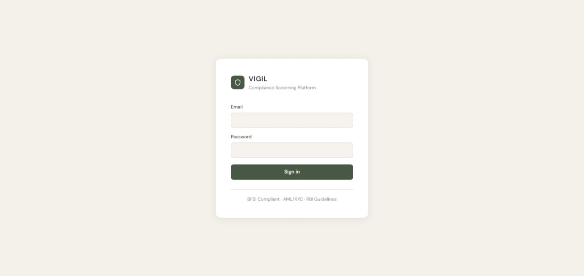
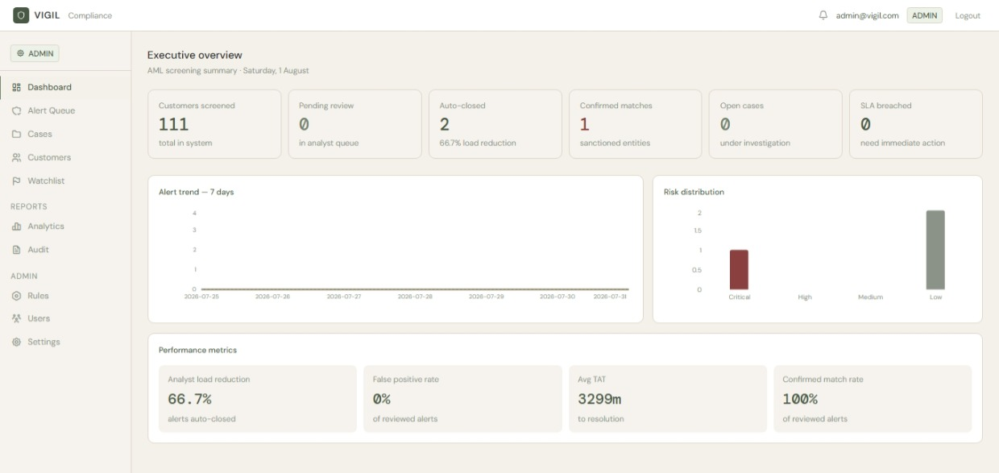
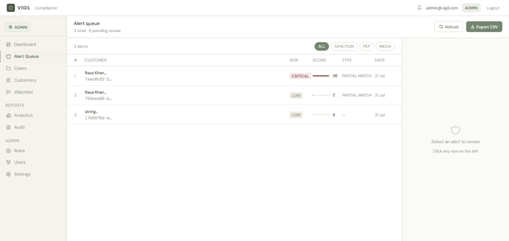
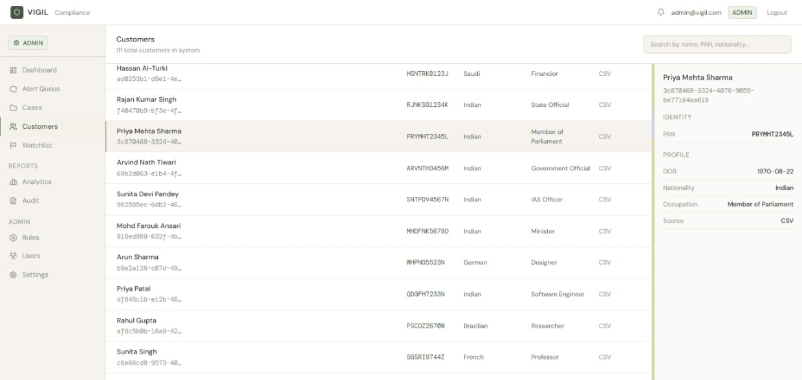

# VIGIL — AML Compliance Screening Platform


> Enterprise-style AML (Anti-Money Laundering) compliance platform built with **FastAPI**, **React**, and **PostgreSQL**.

---

# Live Demo

- **Frontend:** https://vigil-screening-git-main-gayatri9.vercel.app
- **Backend API:** https://vigil-screening.onrender.com
- **Swagger UI:** https://vigil-screening.onrender.com/docs

---

# Overview

VIGIL is a full-stack AML compliance platform that simulates customer screening and investigation workflows commonly used by banks and financial institutions.

The application automates customer screening, calculates risk scores, generates alerts, manages investigations, and records every compliance decision through an audit trail.

---

# Key Features

- Customer onboarding and AML screening
- Explainable risk scoring
- RapidFuzz-based fuzzy name matching
- Internal watchlist management
- Alert investigation workflow
- Case management
- JWT authentication with role-based access control
- Immutable audit logging
- PDF and CSV reporting
- Background processing with Celery and Redis

---

# Screenshots

## Login



---

## Dashboard



---

## Alert Queue



---

## Customers



---

# Compliance Workflow

```text
Customer
    │
    ▼
AML Screening
    │
    ▼
Risk Score
    │
    ▼
Alert Created
    │
    ▼
Analyst Investigation
    │
    ▼
Compliance Officer Review
    │
    ▼
Case Closed
```

---

# System Architecture

```text
                React Frontend
                       │
                  REST API
                       │
                FastAPI Backend
        ┌──────────────┴──────────────┐
        │                             │
 PostgreSQL Database          Celery + Redis
```

---

# Tech Stack

| Layer | Technology |
|-------|------------|
| Frontend | React 19, TypeScript, Vite |
| Styling | Tailwind CSS |
| Backend | FastAPI |
| Database | PostgreSQL, SQLAlchemy |
| Authentication | JWT |
| Validation | Pydantic |
| Background Tasks | Celery, Redis |
| Matching | RapidFuzz |
| Charts | Recharts |
| Reports | ReportLab |
| Containerization | Docker |

---

# Installation

## Prerequisites

- Python 3.11+
- Node.js
- PostgreSQL
- Redis
- Docker (optional)

## Backend

```bash
git clone https://github.com/stargirlg/vigil-screening.git

cd vigil-screening

python -m venv venv

# Windows
venv\Scripts\activate

# Linux/macOS
source venv/bin/activate

pip install -r requirements.txt

# Windows
copy .env.example .env

# Linux/macOS
cp .env.example .env

python -m app.db.init_db
python -m scripts.seed_rules

uvicorn app.main:app --reload
```

## Frontend

```bash
cd frontend

npm install

npm run dev
```

## Docker

```bash
docker compose up --build
```

---

# API Documentation

| Documentation | URL |
|--------------|-----|
| Swagger UI | http://localhost:8000/docs |
| ReDoc | http://localhost:8000/redoc |

---

# Project Structure

```text
vigil-screening/
├── app/
├── frontend/
├── scripts/
├── tests/
├── docs/
├── data/
├── Dockerfile
├── docker-compose.yml
└── README.md
```

---

# Roadmap

- [x] GitHub Actions CI
- [ ] Kubernetes Deployment
- [ ] Prometheus & Grafana Monitoring
- [ ] Email Notifications
- [ ] OFAC / UN Sanctions Integration
- [ ] Customer Risk Rating
- [ ] Batch Screening Dashboard
- [ ] Mobile Responsive Interface

---

# License

This project is licensed under the MIT License.

---

# Author

**Gayatri Gohate**

GitHub: https://github.com/stargirlg

---

VIGIL was built as an enterprise-style portfolio project to demonstrate:

- FastAPI backend development
- React frontend development
- Secure authentication and RBAC
- AML workflow automation
- PostgreSQL database design
- REST API development
- Full-stack application architecture